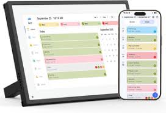
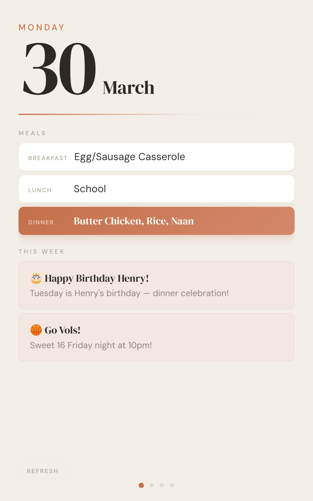
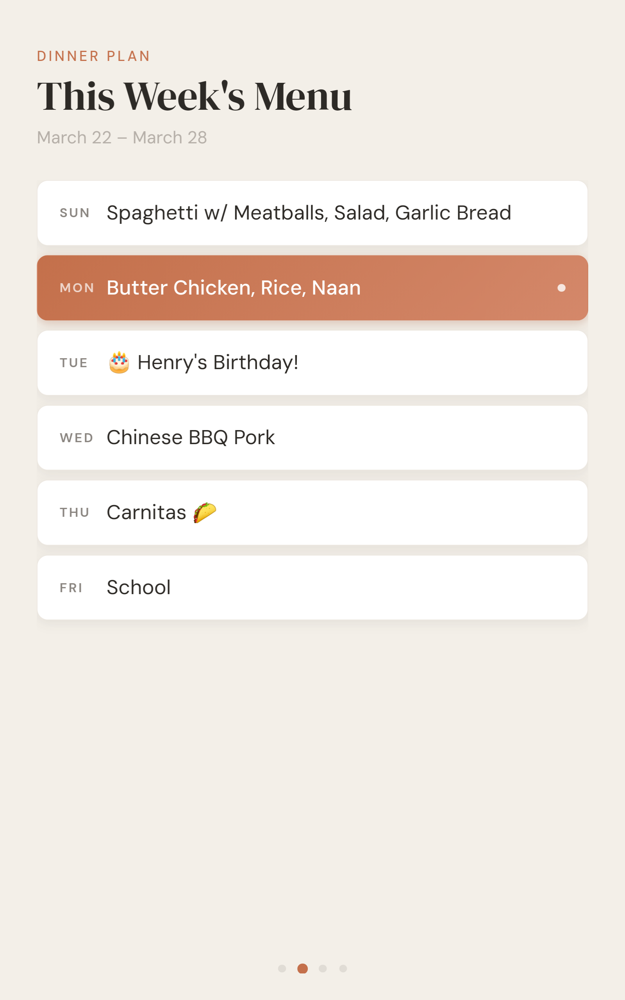
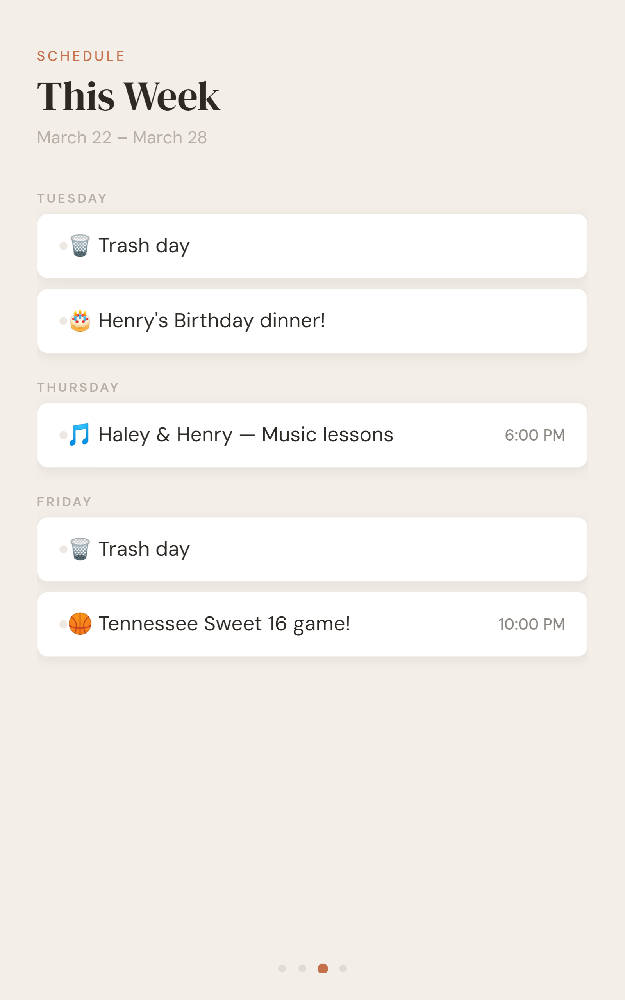
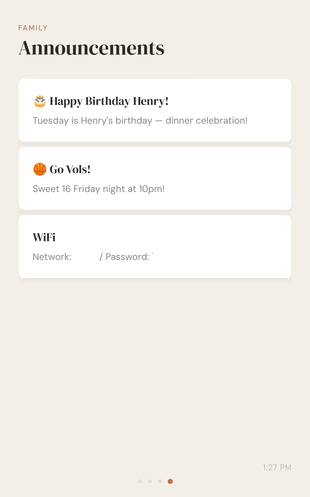

We have a family of seven. Keeping track of meal plans, who goes where, and what's happening this week is a coordination problem that lives in a few different places: scraps on various personal calendars, some texts, some flyers stuck to the fridge, and various family members' heads.

So, I got an [eCalendar](https://a.co/d/06ZMUY6E) display. The thinking was, if I had a digital screen that would show the big stuff at a glance, we could get it out of those various places, and into a single thing that everyone could just look at. This isn't mine, but essentially what it looked like out of the box:



The problem is - it's really not great. It has a number of tabs for things like calendar, chores, todos, meal plans, etc., but it's hard to read at a distance, and takes a ton of manual work to maintain everything week by week. I knew as soon as I saw the admin UI that it wasn't going to be a thing that worked for us.

It sat on the shelf for awhile, but I was bummed. I loved the idea of this centralized screen of information for the family, but *this* wasn't the right execution.

Maybe though, with the help of Claude, I could reuse the hardware and do something better with it. I mean after all, it's a pretty great candidate for this: a nice looking display that's thin, wall mountable, and almost surely running Android.

If we could find a way in, maybe we could hack it to be better? Maybe create a new APK, install it on the device, and run that instead of whatever the tablet was running by default?

## Lobsters in the Bathroom

A couple months ago, I created the [Poopin' Papers](https://poopinpapers.com) as a way to start to solve the family coordination problem. Since the eCalendar sucked, I figured I'd go super old school - I'd print out family newsletters and hang them by the toilet. If anything is going to get read, it's going to get read there.

This was a hit with the family, and the infrastructure behind it (if you can call it that) was very flexible. Each week, I'd ask Hex, my [OpenClaw](https://openclaw.ai) agent running on my local network, to generate a JSON file with all the data - meals, announcements, etc - and host it at an endpoint on my local network. This runs on the Mac Mini that Hex lives on, and is on 24/7 serving this endpoint locally. Something like /family-data.json. This file gets updated weekly, and from there, goes into a printing workflow to create the papers in a consistent, repeatable way.

So, I already had the data. If I could somehow use that data in the eCalendar tablet, then the admin part is done already, and I'm just reusing the same info and displaying it elsewhere. It also has the nice perk of being consistent with the paper version by design.

## Getting In

The eCalendar runs Android 10. It has no USB port. No keyboard. No mouse. Just a touchscreen and a power cable.

To install a custom app, you need ADB (Android Debug Bridge), which is typically something you enable over USB first, then optionally switch to WiFi. But, no USB. So the only way in is via the network.

First attempt: scan the network. I knew the tablet was on WiFi, so I ran `nmap` against every unknown device on my network. Full port scans, all 65,535 ports, on every IP I couldn't identify.

No dice, likely because the device was filtering these incoming connections.

Network scanning uses TCP. You send a SYN, you wait for a SYN-ACK. If the device drops your packets, you get nothing. But, mDNS is different. It's UDP multicast. Devices *announce* themselves to the network whether you ask or not. And Android devices, it turns out, announce their ADB service:

```bash
dns-sd -B _adb._tcp local
```

Immediately: `adb-9LUF85D32HQOCE03X2`. There it is. Resolve the name to an IP, connect, and we're in.

```
dns-sd -L "adb-9LUF85D32HQOCE03X2" _adb._tcp local
# Result: Android-2.local.:5555

dns-sd -G v4 Android-2.local
# Result: 192.168.86.36

adb connect 192.168.86.36:5555
```

All this took Claude like 5-10 minutes to do fully.

## Building an APK Without Android Studio

I didn't want to install Android Studio for what is essentially a 90-line Java file. The app is a `WebView` that loads a URL. That's it.

So we built it with raw command-line tools:

```bash
# Compile Java
javac -source 1.8 -target 1.8 -classpath $ANDROID_JAR -d obj src/.../MainActivity.java

# Convert to DEX (Android bytecode)
d8 obj/com/homeboard/app/*.class --output dex_output/ --lib $ANDROID_JAR

# Package into APK
aapt package -f -M AndroidManifest.xml -S res/ -I $ANDROID_JAR -F app.apk

# Add DEX, align, sign
aapt add -k app.apk classes.dex
zipalign -f -p 4 app.apk app-aligned.apk
apksigner sign --ks debug.keystore app-aligned.apk
```

This worked, eventually. There were some fun detours:

**The cleartext problem.** Android 10 blocks plain HTTP by default. My web server is on the local network, no HTTPS. The WebView would load, try to fetch `http://192.168.86.40:8080`, and get `ERR_CLEARTEXT_NOT_PERMITTED`. This required both a manifest flag *and* a network security config XML file.

**The orientation problem.** The eCalendar is physically a portrait device, but it's mounted on the wall rotated. Trial and error: `landscape` was wrong. `portrait` was upside down. `reversePortrait` was correct. Three deploys to figure that out.

## Becoming the Launcher

The eCalendar ships with its own launcher app — `com.fujia.calendar`. To make our app the default, we register it as a home launcher in the Android manifest:

```xml
<category android:name="android.intent.category.HOME" />
<category android:name="android.intent.category.DEFAULT" />
```

But Android still asks the user to choose between the two. Every time. On a device with no way to long-press "Always."

Easy enough, disable the original, and have one launcher: ours.

```bash
adb shell pm disable-user --user 0 com.fujia.calendar
```

## The Resilience Problem

Here's where the separation of concerns pays off.

The first version had no error handling. If the Mac's web server wasn't running when the tablet booted — which happens after a power outage, because the tablet boots faster than the Mac — the WebView would show Android's default "Webpage not available" error. No retry button. No way to refresh. This was really ugly, and my kids made fun of it mid-week when I accidentally killed the server by kicking the power button accidentally. Shit happens.

We fixed this at two layers:

**The APK layer.** If the WebView can't load the page, retry every 15 seconds. This is the only "smart" thing the Android app does.

**The HTML layer.** If the page loads but the API server is down, show a clock. A nice one — big time display, today's date, a subtle pulsing dot that says "Connecting to server..." This way, even if everything is broken, the thing on your wall is still useful, and I don't get made fun of by kids.

When the API comes back, the clock disappears and the dashboard appears. In between, we cache the last successful API response in localStorage, so stale data beats no data. This was a later addition that was added after learning this the hard way.

This is the advantage of the thin-APK-plus-served-HTML architecture. The HTML handles all the graceful degradation, and I can update it by editing a file on my Mac. No rebuild, no ADB, no deploy. The tablet picks it up on its next refresh.

## The UI

Remember how much I hated that original UI on the eCalendar? The goal with the UI here was primarily on non-interactive consumption. I knew that if I require pre-teens and teens to interact with a thing, they're never going to get the info, so I wanted it more like a kiosk or sign - readable from a distance, brief and quickly consumable.

We came up with a four-screen carousel that can be swiped, and also rotates automatically when not being interacted with.

**Today** is the home screen. A massive date number — 200 pixels tall, serif font, readable from ten feet away. Below that: today's breakfast, lunch, and dinner. Today's events. Any highlighted announcements for the week. A refresh button.



**Menu** shows the full week's dinner plan. Today's row gets an accent-colored gradient so it pops.



("School" on Friday was a weird bug)

**Schedule** shows the week's events grouped by day.



**Announcements** shows family notices — WiFi password, reminders, whatever.



The carousel auto-advances every 30 seconds when nobody's touching it. Touch it and the timer resets.

The whole thing is one HTML file. About 800 lines. No framework, no build step, no dependencies. It uses `var` instead of `let` because the WebView is Chromium 74 and I'm not taking any chances. It uses `margin-bottom` instead of CSS `gap` because the old flexbox implementation doesn't support it.

## The Data

The API is a single JSON endpoint:

```json
{
  "menu": {
    "weekOf": "2026-03-22",
    "meals": [
      { "day": "Sunday", "breakfast": "Crepes", "dinner": "Spaghetti" }
    ]
  },
  "weekly": {
    "events": [
      { "day": "Tuesday", "time": "5:00 PM", "text": "Dance class" }
    ]
  },
  "announcements": [
    { "title": "Henry's Birthday!", "body": "Tuesday dinner", "highlight": true }
  ]
}
```

The `highlight` flag is a nice little design decision. Announcements with `highlight: true` show up on the Today page. Others only appear on the Announcements page. This means the person updating the data feed controls what's prominent without touching any code.

Hex creates this JSON file for me every week, and pipes up in Slack over the weekend to ask me about meal plans, announcements, etc., generates the JSON, and boom, everything just works.

Here's a look at it sitting on my kitchen counter:


## What I Learned

This was a really cool project to try, and a great lesson in just how open and insecure devices around your house can be. It's really fun to repurpose things like this instead of having it just take up space in the house, and it's likely there are other pieces of hardware laying around that I could also look at reusing in interesting ways.

The security bit was eye-opening. It's wild how trivial it was to break into the tablet and completely repurpose it. The mDNS thing alone was a really interesting find, and makes me curious what else I've got lurking around that I can break into.

This was also a testament to what Claude can help out with. Claude basically did all the heavy lifting (including outlining this post with the steps used to get in), and I acted as product manager, steering the vision, thinking through the architecture, and being the human in the loop on the review. It really felt like I'd been given superpowers to make this vision come to life, and is a great example of what a human-machine pairing can look like.
