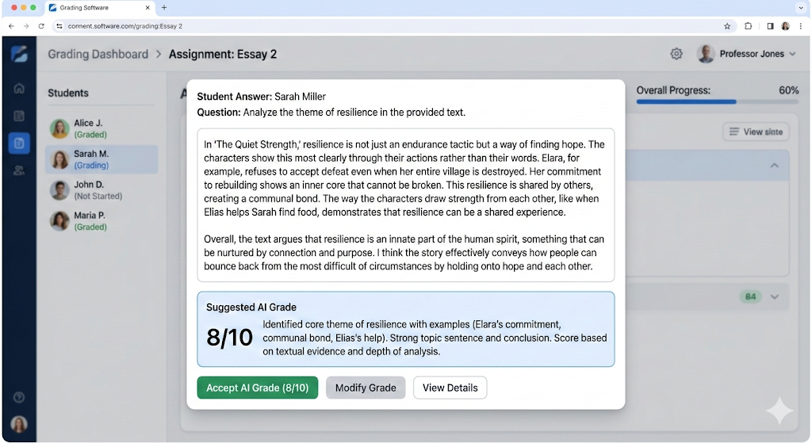

When you give users a default, they [tend to take it](https://en.wikipedia.org/wiki/Default_effect).

This is usually a great boon to user experience: you can help make decisions for the user, instead of requiring them to use cognitive energy to make the decision. The result? An experience that feels very easy, thoughtless and frictionless. A great user experience.

Sometimes though, this is a bad idea.

Sometimes, you *want* a user to think. Sometimes you need judgement and bias, and the other things that humans bring to the table.

## Grading Papers

Earlier today, I saw the UI for some educational software. This was part of the grading interface:

At first glance, this is pretty interesting. Grading subjective answers like this is a PITA - you have to *read* them all. Ugh. If an AI could read them and just give us a head start, well, imagine the time savings!

So, we give a default grade.

This is helpful, especially if it's accurate. Or, accurate enough. Over time.

Let's talk about that over time part.

## Defaults / Time = Tendencies

Remember writing checks? Remember how every year, in January, you'd annoyingly write the wrong month on the check?

You did that because you had a tendency to write the old year. A tendency is like a default choice over time. Sure, you can change it, but you seldomly do. And getting into a **new** tendency is tantamount to breaking one habit and adopting another simultaneously. It's a little easier than that in practice, but it does take some effort, and we, as a species, are pretty lazy.

How does this apply to our grading example above?

Well over time, teachers will tend to select the default. And, as that default gets selected more and more, they'll develop a tendency to stop really reading things and thinking about the students' responses. Once they trust that AI is close enough for the effort tradeoff to pay off, they'll surrender grading for this question, or test, or semester, progressively to automated systems.

Now in *theory*, maybe this is acceptable, maybe the AI can do a BETTER job grading. But, there's something that tells me that helping teachers to unknowingly develop a tendency to outsource grading of subjective answers is probably a net negative move.

Another interesting factor in this is the fact that LLMs aren't static reasoning machines. They change over time, generally improving, but improving on some dimensions at the exclusion of others. This means that your grading is now tethered to something that is actually detached from the general problem of grading in general: the architectural tradeoffs made to a model to maximize some other company performance metric. That sounds like misaligned incentives.

## No AI in Grading?

I don't think the answer is to say "AI can't be used for grading", because it's obvious that there are times when it can legitimately be used to speed up work in a safe, trustworthy way that doesn't have second-order effects. Maybe the answer is, instead of suggesting a grade, to give the teacher feedback on the response and how well it fits the assignment without assigning the number, and ultimately let the teacher assign the number.

Regardless, it's a good example of how subtle design decisions can lead to unintended effects down the road that aren't readily apparent when you look at the UI initially.
